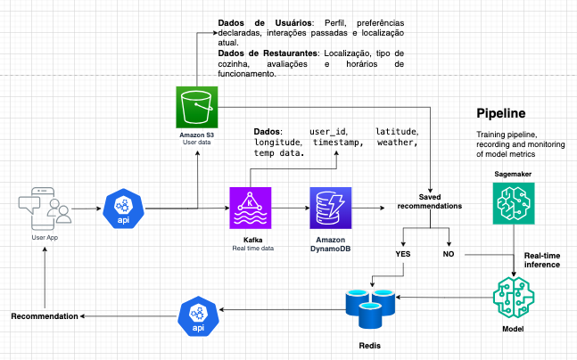

# Case-DS---Recommendation

Você foi contratado(a) por uma empresa que possui um aplicativo de mapa (como Google Maps ou Waze) e foi designado(a) para desenvolver uma nova feature de recomendação de restaurantes para os usuários. A missão é identificar quais restaurantes podem ser sugeridos para cada usuário, sendo exibidos na tela caso o usuário clique no botão para acessar a funcionalidade.

Essa entrega tem como objetivo nos ajudar a entender sua forma de pensar e estruturar uma solução, preparando o terreno para uma discussão mais aprofundada na entrevista técnica. A entrega é obrigatória, mas não eliminatória. O objetivo é entender seu raciocínio e discutir sua solução durante a entrevista.

---

### Orientações

#### 1. Contexto e Escopo
- O aplicativo tem uma base de usuários ativos em diferentes cidades e coleta dados de geolocalização.
- Sua missão é desenvolver um sistema de recomendação que sugira restaurantes para o usuário em tempo real, considerando quaisquer fatores que achar relevantes para a solução.

#### 2. Expectativa
- Não estamos procurando uma resposta única correta – queremos avaliar como você aborda um problema complexo, organiza seus pensamentos e faz decisões baseadas em dados e engenharia.
- A entrega será um ponto de partida para a entrevista técnica. Portanto, não é necessário cobrir todos os detalhes. Durante a entrevista, vamos explorar suas ideias e buscar entender como você lida com limitações práticas, trade-offs e escalabilidade.

#### 3. Diretrizes para a Solução
- Você deve desenhar um sistema de recomendação, explicando:
  - Quais dados você usaria e como os coletaria e armazenaria.
  - Como faria o pré-processamento e a engenharia de recursos (features).
  - Quais algoritmos de recomendação seriam mais apropriados.
  - Como trataria o tempo real e garantiria a escalabilidade da solução.
- Sinta-se livre para incluir diagramas de arquitetura. O mais importante é deixar claro como cada componente se relaciona.
- Use qualquer ferramenta para montar sua solução. Pode utilizar um documento no Microsoft Word, Google Docs, desenhos à mão ou ferramentas digitais (Excalidraw, Draw.io ou qualquer outro software). Sugerimos que mantenha a entrega entre 1 a 2 páginas ou imagens.

## Filtragem Colaborativa, Baseada em Conteúdo e a Combinação Híbrida

### 1. Filtragem Colaborativa com ALS (Alternating Least Squares)
A Filtragem Colaborativa (FC) é uma técnica baseada em encontrar padrões de preferências em interações históricas (ex.: compras ou visitas de clientes a restaurantes). O ALS é um método amplamente utilizado para lidar com essas interações em dados esparsos, como matrizes onde poucos clientes interagem com muitos restaurantes.

**Por que usar ALS?**
* Escalabilidade: Funciona bem em grandes datasets esparsos.
* Exploração de relações latentes: Identifica padrões escondidos, como "clientes que gostaram de A também gostam de B".

### 2. Baseada em Conteúdo com LightGBM ou XGBoost
Os modelos baseados em conteúdo utilizam as características dos restaurantes e preferências do cliente para fazer recomendações personalizadas. Modelos como LightGBM e XGBoost são ideais para explorar essas relações porque:

* Capturam não-linearidades nas interações.
* São robustos a dados tabulares com diferentes tipos de variáveis (categóricas e contínuas).

**Por que usar LightGBM/XGBoost?**
* Excelente desempenho com dados tabulares.
* Flexibilidade para incluir muitas variáveis, como distância e avaliações.
* Rápido e escalável.

### 3. Modelo Híbrido (Combinação de Scores)

### Combinação de Scores

Combine os scores gerados pelos modelos colaborativos (ALS) e baseados em conteúdo (LightGBM/XGBoost) com uma métrica adicional de **distância normalizada**. Isso permite:

- **Personalizar as recomendações** com base no histórico (ALS).
- **Incorporar características específicas** de restaurantes e contexto (LightGBM/XGBoost).
- **Ajustar as recomendações** com base na proximidade geográfica.

---

### Como Funciona

#### **Calcule os Scores**
1. **Score Colaborativo (\( S_c \))**: Probabilidade ou ranking gerado pelo ALS.
2. **Score Conteúdo (\( S_t \))**: Probabilidade gerada pelo LightGBM.
3. **Distância Normalizada (\( S_d \))**: Normalize as distâncias entre 0 e 1:
   
   $$ S_d = 1 - \text{distância normalizada} $$

#### **Combine os Scores**
- Fórmula:
  $$\text{Score Final} = \alpha \cdot S_c + \beta \cdot S_t + \gamma \cdot S_d $$
- Ajuste os pesos (\( \alpha, \beta, \gamma \)) com base em validação cruzada para balancear o impacto de cada componente.

#### Inferência

1. Receba os dados em tempo real (cliente e restaurantes).
2. Calcule a distância e crie as features.
3. Gere os scores colaborativo e de conteúdo.
4. Combine os scores usando os pesos definidos.
5. Retorne os restaurantes mais relevantes em um ranking final.

---
